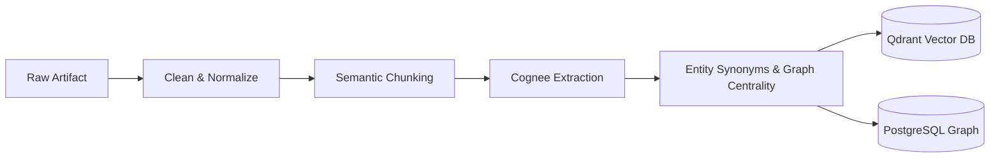
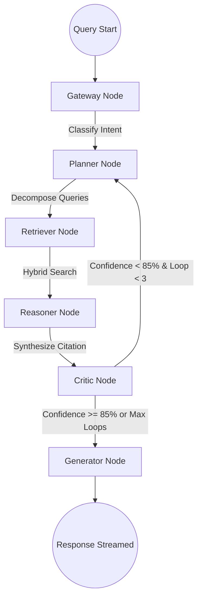

# Engineering Memory OS — Organizational Knowledge Brain

> The permanent, queryable, and reasoning brain of your software organization.

**Engineering Memory OS (EMO)** is a production-grade, open-source AI platform designed to ingest software engineering artifacts (PR diffs, architecture docs, Slack threads, Jira tickets, incidents, meeting notes), extract structured relationships, build an evolving organizational knowledge graph, and answer queries using a self-correcting multi-agent reasoning loop.

Built with a commitment to **Domain-Driven Design (DDD)**, **Clean Architecture**, and **Event-Driven Architecture (EDA)**, the system remains completely decoupled from external frameworks and LLM providers.

---

## 🏗️ Core Architecture & Bounded Contexts

EMO is organized into five isolated **Bounded Contexts** to maintain separation of concerns and system scalability:

1. **Memory Context:** Manages the lifecycle of incoming unstructured data, calculates cryptographic provenance, handles semantic chunking, and tracks staleness via time-based decay.
2. **Knowledge Context (Cognee):** Extracts domain entities (`Actor`, `Component`, `Decision`, `Incident`) and relationship edges (e.g. `[Developer] -> IMPLEMENTED -> [Microservice]`), resolves synonomous nodes, and stores them in Qdrant (vectors) and PostgreSQL (relations).
3. **Agent Context (LangGraph):** Orchestrates multi-agent reasoning, hybrid retrieval, self-correction, and citation-backed synthesis via a StateGraph.
4. **Integration Context:** Concrete adapters for external integrations (GitHub, Jira, Slack, Notion) to sync artifacts into the ingestion pipeline.
5. **Gateway Context:** Manages LLM client routing, token use audits, request costs, and circuit-breaker triggers with local model fallbacks.

```
       ┌────────────────────────────────────────────────────────┐
       │                   Presentation Layer                   │
       │        (FastAPI REST Routes & WebSockets, DTOs)        │
       └───────────────────────────┬────────────────────────────┘
                                   │
                                   ▼
       ┌────────────────────────────────────────────────────────┐
       │                   Application Layer                    │
       │       (Use Cases, Pipelines, Event Handlers/Bus)       │
       └───────────────────────────┬────────────────────────────┘
                                   │
                                   ▼
       ┌────────────────────────────────────────────────────────┐
       │                      Domain Layer                      │
       │      (Enterprise Rules, Entities, Value Objects)       │
       └───────────────────────────▲────────────────────────────┘
                                   │ (Implements Interfaces)
       ┌───────────────────────────┴────────────────────────────┐
       │                  Infrastructure Layer                  │
       │       (PostgreSQL, Qdrant, Cognee, LLMs, Telemetry)    │
       └────────────────────────────────────────────────────────┘
```

---

## 🛠️ Technology Stack

| Component | Technology | Purpose |
| :--- | :--- | :--- |
| **Backend API** | FastAPI + Python 3.12 | Async REST API, WebSocket streams |
| **Relational DB** | PostgreSQL 16 | Audits, metadata, users, entity links |
| **Vector DB** | Qdrant | High-dimensional semantic similarity search |
| **Knowledge Graph** | Cognee 1.0 | Entity extraction & topology mapping |
| **Agent Engine** | LangGraph | Stateful, cyclic reasoning graph |
| **Frontend UI** | Next.js 15 (React 19) | Terminal-inspired dark mode UI |
| **Graph Viz** | React Flow | Interactive knowledge graph browser |
| **Local LLM** | Ollama | Fallback/privacy offline LLM provider |
| **Observability** | OpenTelemetry | Distributed tracing, token-cost metrics |

---

## 📁 Repository Structure

```text
Hack-1/
├── docker-compose.yml       # Multi-service setup for PostgreSQL, Qdrant, Backend, Worker, Frontend
├── api.md                   # Complete REST & WebSocket API Specification
├── needs.py                 # Core commands and developer quick reference
├── LICENSE                  # Project licensing (MIT)
└── eng-memory-os/           # Main application subfolder
    ├── backend/
    │   ├── src/eng_memory_os/
    │   │   ├── cmd/         # Entry points (API server, worker processes, configurations)
    │   │   ├── domain/      # Pure python domain logic (shared, memory, knowledge, agent, gateway)
    │   │   ├── application/ # Orchestration, use cases, event subscriptions
    │   │   ├── infrastructure/ # DB clients, Cognee graph adapters, LLM clients, LangGraph definitions
    │   │   └── presentation/# REST routes, Websocket routers, schema DTOs
    │   ├── pyproject.toml   # uv-based dependency configuration
    │   └── tests/           # Unit and Integration test containers
    ├── frontend/
    │   ├── src/app/         # Next.js 15 app pages (Chat, Graph, Ingest, Integrations, Settings)
    │   └── package.json     # Node.js configurations
    ├── deploy/              # Dockerfiles and deployment configurations
    └── docs/                # Architecture design specifications
```

---

## 🔄 The Memory Ingestion Pipeline

Incoming artifacts go through a strict, multi-stage processing pipeline:



1. **Ingest:** Accepts raw documents, PR diffs, or tickets.
2. **Normalize:** Strip noise and clean markdown syntax.
3. **Semantic Chunking:** Break documents dynamically according to semantic boundaries (not hard token counts).
4. **Entity Extraction:** Identify entities like `Actor`, `Component`, `Decision`, and `Incident`.
5. **Relationship Mapping:** Link entities (e.g. `Incident-402` -> AFFECTED -> `Component-Auth`).
6. **Vectorization & Storage:** Chunks are vectorized into Qdrant and relationship edges are mapped into PostgreSQL.

---

## 🧠 LangGraph Multi-Agent System

Rather than using simple, linear prompts, EMO uses a **cyclic StateGraph** to process search queries, verify facts against retrieved evidence, and self-correct if hallucinations are suspected:



* **Gateway Node:** Classifies incoming request intent (e.g. search, settings, ingestion query).
* **Planner Node:** Decomposes complex queries into simple retrieval sub-tasks.
* **Retriever Node:** Performs hybrid search, executing vector searches, graph centrality/neighbor traversal, and BM25 lexical keyword matches.
* **Reasoner Node:** Drafts response text using retrieved evidence.
* **Critic Node:** Validates reasoning against original evidence. If confidence is `< 0.85`, it triggers a query refinement loop (up to 3 times before fallback).
* **Generator Node:** Emits the final output with markdown and precise inline citations `[Evidence ID]`.

---

## 🚀 Quick Start

### Prerequisites

* Docker Desktop
* Python 3.12+ with [uv package manager](https://docs.astral.sh/uv/)
* Node.js 20+

### One-Command Setup (Docker Compose)

To boot PostgreSQL, Qdrant, Backend FastAPI, Background Worker, and Frontend UI:

```bash
docker-compose up --build
```

Access the application dashboard at: `http://localhost:3001` (FastAPI backend docs at `http://localhost:8000/docs`).

To include **Ollama** for local-only execution:

```bash
docker-compose --profile local-llm up --build
```

---

## 💻 Local Development Setup

### 1. Configuration

Copy the sample environment file in `eng-memory-os/` and configure your credentials:

```bash
cd eng-memory-os
cp .env.example .env
```

### 2. Backend

Navigate to the backend folder, install dependencies using `uv`, run database migrations, and boot the server:

```bash
cd backend
uv sync

# Run migrations
uv run alembic upgrade head

# Start background worker
uv run python -m eng_memory_os.cmd.worker

# Start API server
uv run uvicorn eng_memory_os.cmd.api_server:app --reload --port 8000
```

### 3. Frontend

Navigate to the frontend folder, install packages, and boot the Next.js development server:

```bash
cd ../frontend
npm install
npm run dev
```

The client dashboard runs on `http://localhost:3000` (connecting to backend at `http://localhost:8000`).

---

## 📊 API & Interaction Specification

* **REST API:**
  * `POST /api/v1/memories`: Ingest new engineering artifacts.
  * `POST /api/v1/memories/query`: Synchronously query the knowledge base.
  * `GET /api/v1/knowledge/nodes`: Search and browse graph nodes.
  * `GET /api/v1/knowledge/nodes/{node_id}/neighbors`: Fetch neighbor subgraphs (React Flow visualization ready).
* **WebSocket Queries:**
  * Endpoint: `ws://localhost:8000/ws/query`
  * Receives: `{ "type": "query", "text": "Why did we switch to Postgres?" }`
  * Streams real-time progressive reasoning progress updates (`type: "progress"`) before sending the final answer (`type: "response"`).

For the full specifications, read the [REST & WebSocket API Guide](file:///e:/Hackathon/Hack-1/api.md).

---

## 🧪 Testing & Linting

EMO uses a rigorous testing pyramid containing unit tests and Docker-based container integration tests.

### Run Linter & Type Checker

```bash
cd eng-memory-os/backend
uv run ruff check .
uv run pyright
```

### Run Tests

```bash
# Run unit tests
uv run pytest -m unit

# Run integration tests (requires Docker daemon for Testcontainers)
uv run pytest -m integration
```

---

## 📝 License

Distributed under the MIT License. See [LICENSE](file:
