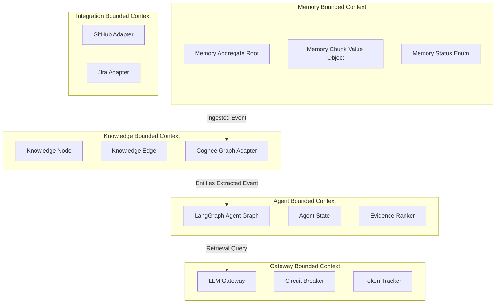
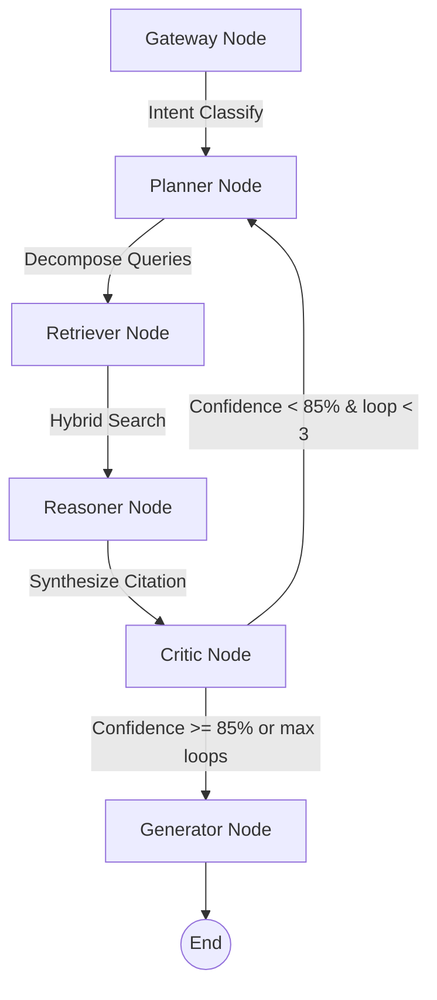

# Architecture & Design Specifications

Engineering Memory OS is structured around strict principles of **Domain-Driven Design (DDD)**, **Clean Architecture**, and **Event-Driven Architecture (EDA)**.

---

## 1. Domain-Driven Design (DDD) & Bounded Contexts

The application is modeled into five Bounded Contexts inside `src/eng_memory_os/domain/`:



- **Memory Context:** Handles incoming raw documents, computes cryptographic provenance, chunks text semantically, and tracks staleness via time-based decay.
- **Knowledge Context:** Leverages LLMs to extract structural entities/relationships, merges synonym nodes, and calculates PageRank/centrality scores.
- **Agent Context:** Orchestrates user queries through a multi-agent StateGraph with validation loops.
- **Gateway Context:** Proxies all LLM requests with fallback capability, circuit breakers, and token cost auditing.
- **Integration Context:** Manages external connections for data sync.

---

## 2. Clean Architecture Pattern

All dependencies point inwards. The core business rules (Domain Layer) have no external dependencies or import statements pointing to frameworks or libraries outside of standard Python.

```
       [ Presentation Layer ] (FastAPI Routes, WebSockets, DTOs)
                │
                ▼
        [ Application Layer ] (Use Cases, Event Handlers, Pipelines)
                │
                ▼
          [ Domain Layer ] (Entities, Value Objects, Interfaces)
                ▲
                │
      [ Infrastructure Layer ] (SQLAlchemy, Alembic, Qdrant, Cognee)
```

- **Domain Layer:** Base interfaces (Repositories, Gateways, Event Bus), pure domain entities (e.g. `Memory`, `KnowledgeNode`), and custom exception hierarchies.
- **Application Layer:** Application services, domain event handlers, orchestration pipelines (e.g., `MemoryPipeline`), and clean DTO-to-entity mappings.
- **Infrastructure Layer:** Concrete database adapters, LLM provider clients, search integrations, and serialization.
- **Presentation Layer:** FastAPI routes, WebSocket query streams, CORS, request correlation middlewares, and response schema definitions.

---

## 3. Event-Driven Architecture

An asynchronous in-process event bus wires up decoupling boundaries.
When a Memory is ingested, it publishes a `MemoryIngested` event. An event subscriber picks this up to trigger the semantic chunking, embedding, vector database storage, entity extraction, and relationship mapping pipeline stages. If the entity extraction adds sufficient graph nodes, it triggers a `GraphOptimized` workflow.

---

## 4. Multi-Agent System (LangGraph)

The system uses a 6-node compiled StateGraph with self-correction retry capabilities:



- **Gateway Node:** Detects intent.
- **Planner Node:** Generates sub-queries.
- **Retriever Node:** Merges results of vector similarity, graph centrality, and BM25 keywords.
- **Reasoner Node:** Synthesizes response with citation footnotes.
- **Critic Node:** Detects hallucinations. If confidence is low, loops back to refine.
- **Generator Node:** Formats response text.
